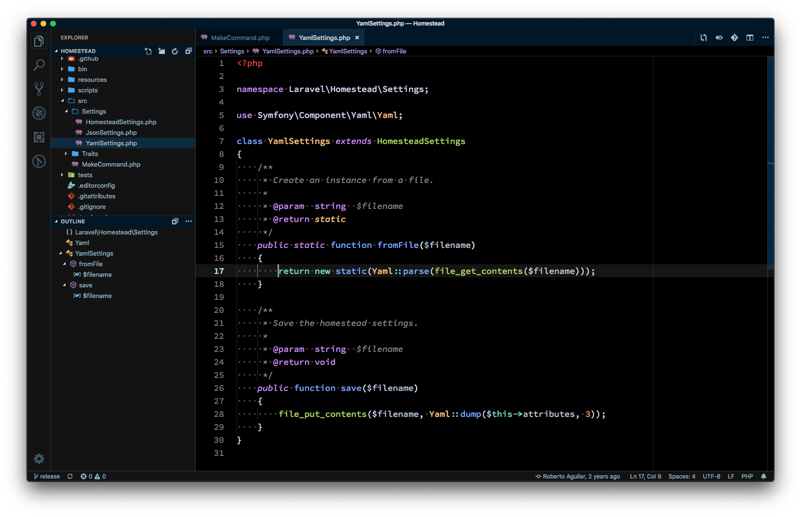

# Night Owl Black
A Visual Studio Code theme based on the excellent Night Owl theme by Sarah Drasner. 

The main difference is the black background in the editor, dark grey UI, and a few other tweaks to increase contrast. I'm legally blind so these and have constract sensitivity issues, and so far these colors work best for me.

## Night Owl Black

